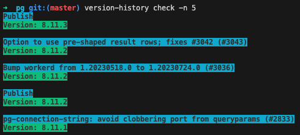

# Version History

## Description

This is a simple script to check the package version of each commit on a branch of a Node.js project.

## Usage

1. To install -- from the root of this project run `npm i -g .`
2. Navigate to the root of the project you want to check the version history of, I suggest running this script on the main branch.
3. `version-history check -n <NUMBER_OF_COMMITS_TO_INCLUDE>`

## Example

